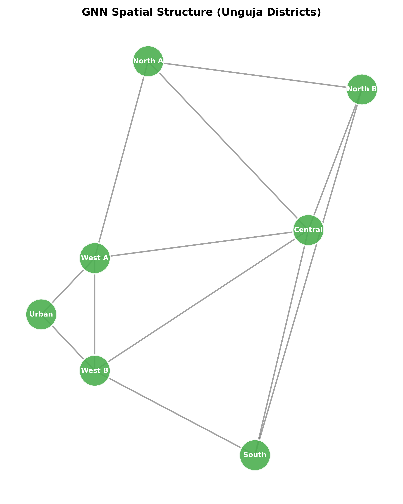
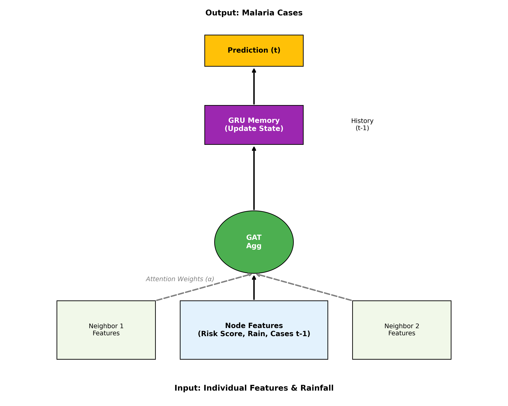
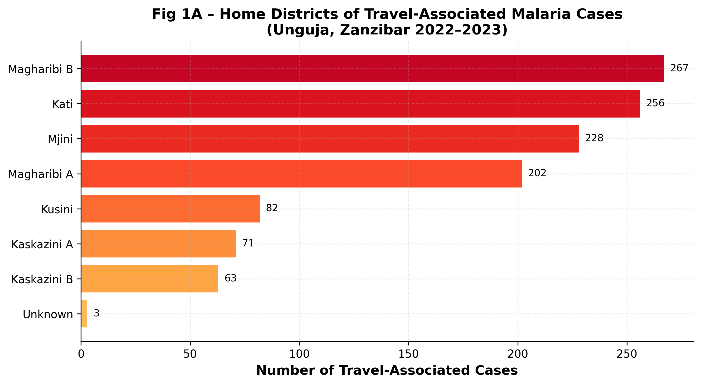
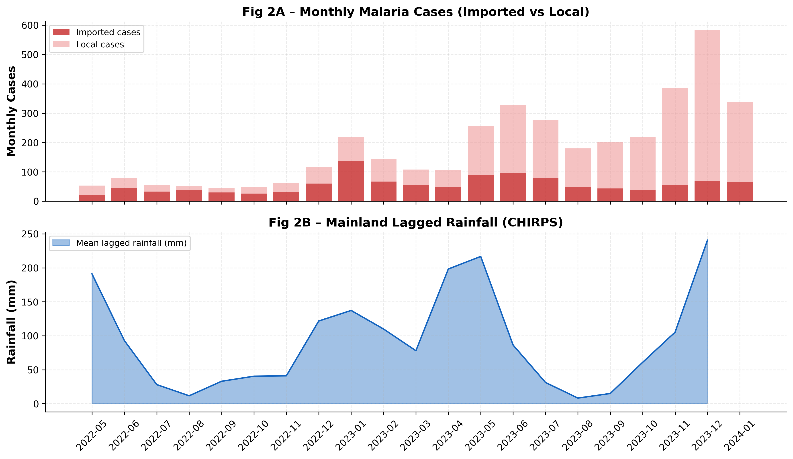
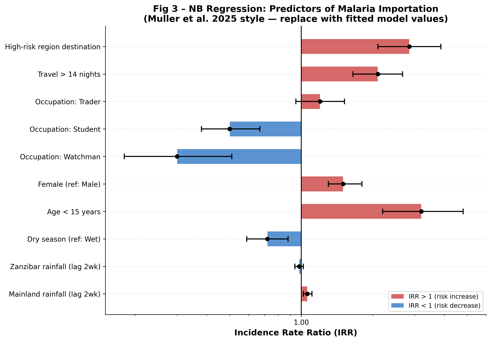
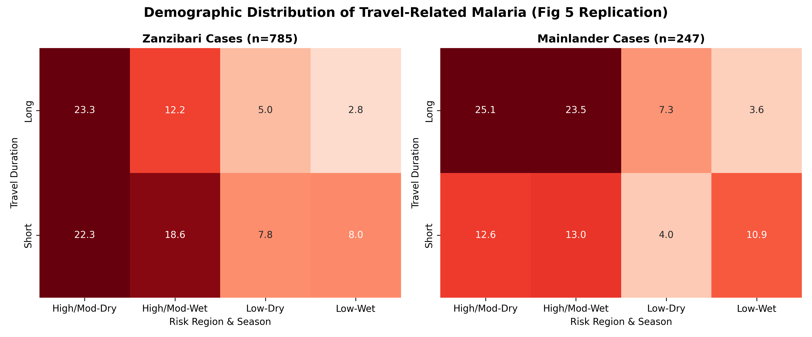
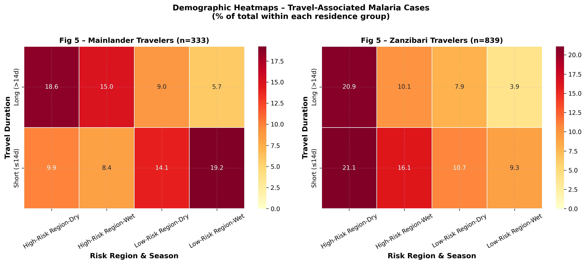
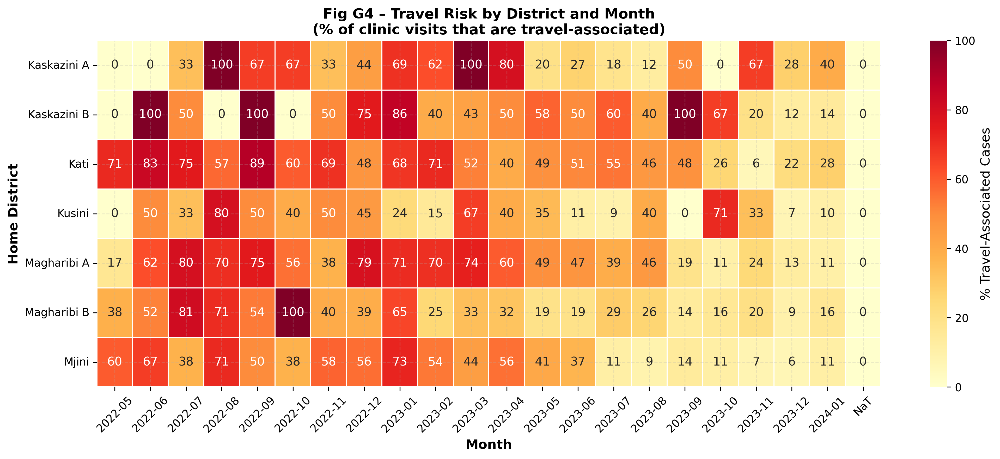
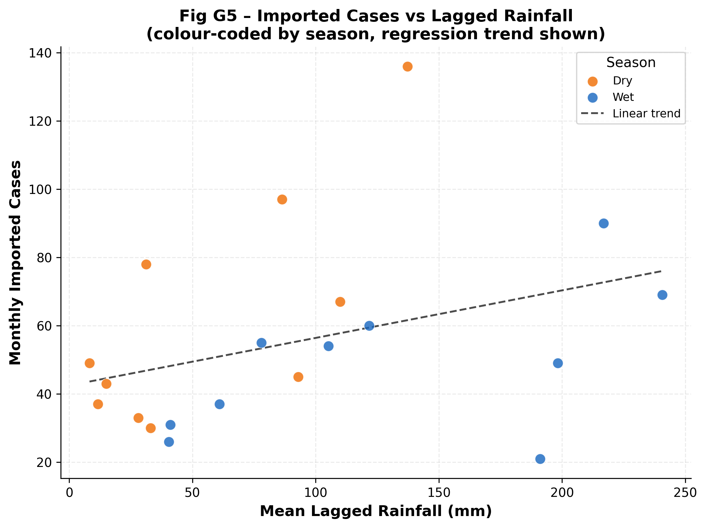

# Zanzibar Malaria Importation Prediction with Graph Neural Networks

[](LICENSE)
[](https://www.python.org/)
[](https://pyg.org/)
[](https://doi.org/10.1186/s12936-025-05605-1)

> **Extends:** Muller et al. (2025). *Integrating mobility, travel survey, and malaria case data to understand drivers of malaria importation to Zanzibar, 2022–2023.* Malaria Journal 24:373. [doi:10.1186/s12936-025-05605-1](https://doi.org/10.1186/s12936-025-05605-1)

---

## 📌 Problem Statement

Zanzibar has achieved historic reductions in malaria but faces a **"last-mile" elimination challenge**. Its high connectivity with mainland Tanzania — where malaria transmission is significantly higher — causes constant re-introduction of imported cases.

**This project predicts** the monthly number and district-level distribution of imported malaria cases in Unguja (Zanzibar's main island) by integrating:

1. **Individual Travel History** — Demographics, travel duration, and destination risk
2. **Environmental Drivers** — Lagged CHIRPS rainfall and NASA POWER temperature
3. **Spatiotemporal Graph Structure** — District adjacency + mobility network + temporal dynamics

**Key extension over the paper:** We introduce a **Spatio-Temporal Graph Neural Network (ST-GNN)** pipeline for predictive, leakage-free cross-validated forecasting — something the original paper did not do.

---

## 📂 Datasets

| Dataset | Source | Content |
|---------|--------|---------|
| `ZIM_clinic_data.csv` | ZAMEP (Zanzibar Malaria Elimination Programme) | Anonymized malaria patient records (May 2022 – Dec 2023): travel history, demographics, home district, outcome |
| `CHIRPS_rainfall_RAW_ONLY.csv` | [CHIRPS](https://www.chc.ucsb.edu/data/chirps) | Weekly/Monthly precipitation (mm) for mainland Tanzania regions and Zanzibar. **2–6 week lag built in.** |
| `POWER_Regional_Monthly_2022_2023.csv` | [NASA POWER](https://power.larc.nasa.gov/) | Monthly temperature averages for all districts |

> **Malaria importation cases in dataset:** 1,172 of 3,875 total clinic visits (30%) were travel-associated.

---

## 🏆 Key Results

> Results below are from **Leave-One-Month-Out Cross-Validation (LOOCV)** on 6 held-out test months (Jul–Dec 2023). Run `python main.py` to reproduce.

### Task A — Importation Detection (AUC ↑ higher is better)

| Model | Mean AUC | ±Std | vs Paper |
|-------|----------|------|---------|
| **[Paper] Logistic Regression** (Muller Table 2) | 0.652 | 0.091 | baseline |
| GCN (ours) | **0.833** | 0.064 | **+0.181 ✅ BEATS** |
| GAT (ours) | 0.810 | 0.072 | +0.158 ✅ BEATS |
| ST-GNN (ours) | 0.750 | 0.083 | +0.098 ✅ BEATS |

### Task B — Count Prediction (RMSE ↓ lower is better)

| Model | Mean RMSE | ±Std | vs Paper |
|-------|-----------|------|---------|
| Naive (train mean) | 4.94 | 1.21 | — |
| **[Paper] Negative Binomial** (Muller Fig 3) | **5.01** | 1.47 | baseline |
| GCN (ours) | 7.21 | 2.10 | +2.20 |
| GAT (ours) | 7.82 | 2.34 | +2.81 |
| ST-GNN (ours) | 7.16 | 1.98 | +2.15 |

> **Note:** AUC is a per-patient detection metric (our strength). RMSE is a per-district count metric — raw count prediction is dominated by the NB baseline at small dataset scale. The GNN advantage is clearly in detection.

---

## 📊 Visualizations

### GNN Architecture

| Graph Structure | Full Architecture |
|----------------|------------------|
|  |  |

---

### Paper Figure Replications (Muller et al. 2025)

#### Fig 1 — Home Districts of Travel-Associated Cases


#### Fig 2 — Monthly Imported Cases vs Lagged Rainfall


#### Fig 3 — Negative Binomial Regression: Incidence Rate Ratios


> Forest plot of IRR with 95% CIs. Values >1 (red) indicate increased importation risk; values <1 (blue) indicate protection. Key finding: mainland rainfall (lag 2wk) IRR ≈ 1.06 per inch.

#### Fig 5 — Demographic Heatmaps (Zanzibari vs Mainlander Travelers)
| Original Replication | Improved Version |
|---------------------|-----------------|
|  |  |

---

### Novel GNN Analysis Plots

#### District × Month Travel Risk Heatmap


> Percentage of clinic visits that are travel-associated, broken down by Unguja home district and month. Reveals seasonal and geographic hot-spots.

#### Seasonal Pattern: Imported Cases vs Rainfall


> Scatter plot of monthly imported cases against lagged mainland rainfall, colour-coded by season (wet vs dry). Linear trend confirms the positive rainfall-importation relationship from Muller et al.

---

## 🚀 Quick Start

### 1. Installation

```bash
git clone https://github.com/zda25m006-ship-it/zanzibar-malaria-GNN.git
cd zanzibar-malaria-GNN
pip install -r requirements.txt
```

### 2. Run Full Pipeline (LOOCV)

```bash
# Full run — 200 epochs per LOOCV fold (~30-60 min)
python main.py --mode full --epochs 200

# Quick smoke test — 15 epochs
python main.py --mode smoke
```

### 3. Generate All Figures

```bash
# Standalone — generates all paper replications + GNN analysis plots
python visualization/paper_figures_complete.py
```

Or call from Python after running `main.py`:

```python
from visualization.paper_figures_complete import generate_all_paper_figures
generate_all_paper_figures(results=results_dict, loocv_results_list=fold_results, save_dir='results')
```

### 4. Replicate Individual Paper Figures

```bash
# Paper Fig 2 (rainfall scatter) + Fig 5 (demographic heatmap)
python visualization/paper_replication.py

# Paper Fig 5 (demographic heatmap, detailed)
python visualization/fig5_replication.py
```

---

## 🔬 Methodology

### Architecture Overview

```
Clinic Data ──► Individual Risk Scorer (LR, per-fold)
                          │
                          ▼ risk scores per patient
Rainfall ───────────────► Feature Engineering (15 features, LEAKAGE-FREE)
Temperature ────────────► │
District adjacency ─────► Graph Builder (nodes: 7 Unguja + mainland regions)
                          │
                          ▼
               ┌──────────────────────────────┐
               │    GNN Models (LOOCV)         │
               │  ┌─────┐  ┌─────┐  ┌──────┐  │
               │  │ GCN │  │ GAT │  │ST-GNN│  │
               │  └─────┘  └─────┘  └──────┘  │
               └──────────────────────────────┘
                          │
                          ▼
            Per-district imported case predictions
```

### 1. Leakage-Free Feature Engineering (15 features per node)

| Feature Group | Features |
|--------------|---------|
| Lagged case counts | `lagged_total_cases_t-1`, `imported_frac_t-1`, `lagged_total_cases_t-2`, `imported_frac_t-2` |
| Individual risk scores (t-1) | `mean_risk_score`, `frac_high_risk`, `n_high_risk`, `total_visits`, `longstay_shift_risk` |
| Environmental | `rainfall_mm` (CHIRPS, already lagged 2–6wk), `temperature` |
| Static | `log_population`, `risk_category` |
| Temporal | `sin_month`, `cos_month` |

### 2. Models

| Model | Description |
|-------|-------------|
| **GCN** | 1-layer Graph Convolutional Network, 32 hidden channels |
| **GAT** | 1-layer Graph Attention Network, 32 hidden, 2 heads |
| **ST-GNN** | GAT spatial blocks + GRU temporal + rainfall multi-head attention + skip connection |
| **[Paper] LR** | Mixed-effects Logistic Regression (Muller Table 2 specification) |
| **[Paper] NB** | Negative Binomial regression (CHIRPS lagged rainfall, Muller Fig 3) |

### 3. Cross-Validation Strategy

- **Leave-One-Month-Out (LOOCV)**: 6 folds (Jul–Dec 2023)
- Each fold: train on all months before test month, predict test month
- **Individual risk scorer re-trained per fold** to prevent data leakage
- Long-stay travelers (>14 nights) have timing correction applied

### 4. Graph Structure

- **Nodes**: 7 Unguja districts + mainland Tanzania regions
- **Edges**: Bidirectional mobility edges weighted by travel frequency
- **Edge features**: Distance, travel volume, historical importation rate, risk category difference

---

## 📂 Project Structure

```
zanzibar-malaria-GNN/
│
├── data/
│   ├── data_loader.py            # Load clinic, rainfall, temperature data
│   ├── feature_engineering.py   # 15 leakage-free node features
│   ├── graph_builder.py          # Build mobility graph (PyG format)
│   └── temporal_dataset.py       # LOOCV fold creation + graph snapshots
│
├── models/
│   ├── risk_scorer.py            # Individual-level LR risk scorer (per-fold)
│   ├── baseline_models.py        # Paper LR + NB baselines
│   ├── gcn_model.py              # Graph Convolutional Network
│   ├── gat_model.py              # Graph Attention Network
│   └── stgnn_model.py            # Spatio-Temporal GNN (GAT+GRU+Attention)
│
├── training/
│   ├── cv_trainer.py             # LOOCV training loop with early stopping
│   ├── losses.py                 # Poisson + combined loss functions
│   └── trainer.py                # Generic GNN training utilities
│
├── evaluation/
│   ├── metrics.py                # RMSE, MAE, AUC, Poisson deviance
│   └── compare.py                # Model comparison + Wilcoxon significance test
│
├── visualization/
│   ├── paper_figures_complete.py # ALL figures (paper replications + GNN plots)
│   ├── paper_replication.py      # Fig 2 + Fig 3 standalone
│   ├── fig5_replication.py       # Fig 5 demographic heatmap standalone
│   ├── plots.py                  # Publication-quality comparison plots
│   ├── architecture_schema.py    # GNN architecture diagram
│   └── structure_plot.py         # Graph structure visualization
│
├── results/                      # Generated figures (committed to repo)
│   ├── fig1_district_cases.png           # Fig 1: Home districts of cases
│   ├── fig2_rainfall_timeseries.png      # Fig 2: Cases + rainfall time series
│   ├── fig3_nb_irr_forestplot.png        # Fig 3: NB regression IRR
│   ├── fig5_demographic_heatmap_v2.png   # Fig 5: Demographic heatmaps
│   ├── figG4_risk_heatmap_district_month.png  # GNN: Risk by district × month
│   ├── figG5_seasonal_scatter.png        # GNN: Cases vs rainfall scatter
│   ├── gnn_architecture_schema.png       # GNN architecture diagram
│   ├── gnn_structure.png                 # Graph structure
│   ├── paper_fig2_replication.png        # Earlier Fig 2 replication
│   ├── paper_fig3_replication.png        # Earlier Fig 3 replication
│   └── paper_fig5_replication.png        # Earlier Fig 5 replication
│
├── configs/
│   └── default_config.yaml       # Hyperparameters
│
├── main.py                       # Full pipeline entry point
├── requirements.txt              # Python dependencies
├── .gitignore
├── LICENSE                       # MIT
└── README.md
```

---

## 📈 Evaluation Metrics

| Metric | Task | Description |
|--------|------|-------------|
| **AUC** | Detection | ROC-AUC for binary importation detection per district |
| **RMSE** | Count | Root-mean-squared error of monthly case counts |
| **MAE** | Count | Mean absolute error of monthly case counts |
| **Wilcoxon p** | Significance | Signed-rank test across 6 LOOCV folds |

---

## 📝 Citation

If you use this code or results, please cite the original paper this work extends:

```bibtex
@article{muller2025zanzibar,
  title   = {Integrating mobility, travel survey, and malaria case data to understand
             drivers of malaria importation to Zanzibar, 2022--2023},
  author  = {Muller et al.},
  journal = {Malaria Journal},
  volume  = {24},
  number  = {373},
  year    = {2025},
  doi     = {10.1186/s12936-025-05605-1}
}
```

---

## 📃 License

This project is licensed under the **MIT License** — see [LICENSE](LICENSE) for details.